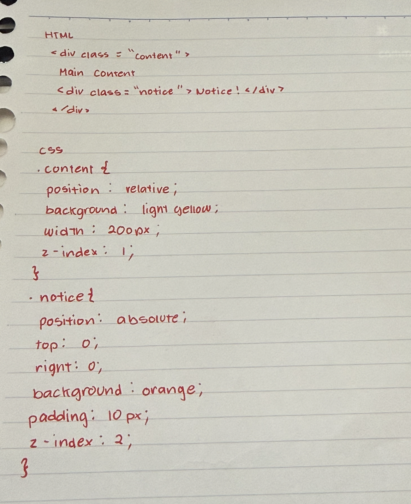

# Seatwork #2 – CSS Position and z-index  
**Name/s:** Avisha Reyes & Enzo Lustre
**Date:** March 27, 2026  

---

## Guided Questions

### Step 1: Static vs Relative

**Answer:**  
With `position: relative`, the sidebar remains in its original place in the document flow, but it can now be moved using `top`, `left`, `right`, or `bottom`. In this case, `top: 20px` moves it downward and `left: 20px` moves it to the right.

In contrast, with the default `static` positioning, the `top` and `left` properties do not work.

Changing the values:
- Increasing `top` moves the element further down  
- Increasing `left` moves it further right  
- Using `bottom` moves it upward  
- Using `right` moves it left  

---

### Step 2: Fixed

**Answer:**  
When scrolling the page, the footer stays fixed at the bottom of the screen and does not move. This is because `position: fixed` attaches the element to the viewport.

This is different from `position: relative` because relatively positioned elements still move with the page and remain part of the normal document flow.

---

### Step 3: Absolute

**Answer:**  
`position: absolute` removes the element from the normal document flow and allows it to be placed at a specific location using `top`, `left`, `right`, or `bottom`.

It is different from `fixed` because:
- `absolute` is positioned relative to the nearest positioned parent element  
- `fixed` is positioned relative to the browser window and stays in place when scrolling  

---

### Step 4: Absolute + z-index

**Answer:**  
The notice appears on top because it has a higher `z-index` value (`2`) compared to the content (`1`). Elements with higher `z-index` values are displayed in front.

If the values are swapped, the content will appear on top of the notice instead.

---

## Challenge

### 1. 

**Answer:**

### 2. 

**Answer:**  
When `.content` is set to `position: relative`, it stays in its normal position in the document flow and moves along with the page when scrolling. It also becomes the reference point for the absolutely positioned `.notice`.

When `.content` is set to `position: fixed`, it is removed from the document flow and becomes attached to the viewport. It stays in the same position on the screen even when scrolling, and the `.notice` remains positioned relative to it.

---

### 3. 

**Answer:**  
The `z-index` controls which element appears in front when the `.notice` and `.content` overlap. The element with the higher `z-index` value appears on top, while the one with the lower value appears behind. Changing their `z-index` values changes which element is visible in front.

---

## Reflection Questions

### a. 

**Answer:**  
- **Static:** Default positioning. Elements follow the normal document flow and cannot be moved using `top`, `left`, `right`, or `bottom`.  
- **Relative:** The element stays in its original position but can be adjusted using positioning properties. Its original space is still preserved.  
- **Absolute:** The element is removed from the normal document flow and is positioned relative to its nearest positioned parent.  
- **Fixed:** The element is removed from the document flow and is positioned relative to the viewport. It stays in place even when scrolling.

---

### b. 

**Answer:**  
Absolute positioning depends on the nearest parent element that has a position other than `static`. The element will be positioned relative to that parent. If no such parent exists, it will be positioned relative to the entire page.

---

### c. 

**Answer:**  
`position: fixed` keeps an element in the same position on the screen at all times, even when scrolling.

`position: sticky` behaves like a normal element at first, but once the user scrolls to a certain point, it sticks in place. It only remains within the boundaries of its parent container.

---

### d.

**Answer:**  
I would use positioning to highlight important information by making key elements more visible.

For example, I can use `position: fixed` for a header so the event title and navigation stay visible while scrolling. I can use `position: sticky` for a schedule so time labels remain visible. I can use `position: absolute` to place a “Register Now” button at the top corner of a section. I can also use `z-index` to make important announcements like “Deadline Extended :D” appear on top of other content.